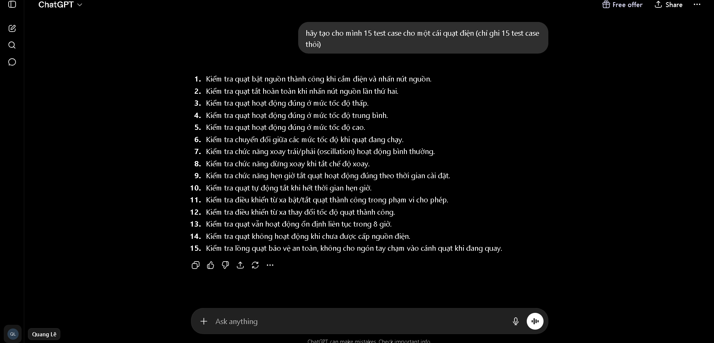

# Lịch sử Prompt (Prompt Log)

---

### Tạo mindmap QA/QC
- **Công cụ:** Gemini 3.5 Flash
- **Thời gian (Timestamp):** 17:44 01/06/2026
- **Prompt:** Hãy tạo cho tôi mindmap về QA/QC role (hình ảnh, bằng tiếng việt)
- **Kết quả:** 

### Tìm 20 lỗi phần mêm (phần 1)
- **Công cụ:** Gemini 3.5 Flash
- **Thời gian (Timestamp):** 11:29 04/06/2026
- **Prompt:** Hãy tìm 20 lỗi phần mềm (software defects) được công bố từ năm 2022 đến 2026 (trong đó có 5 lỗi liên quan đến AI/LLM như hallucination, prompt injection, bias). Đưa mình source link, mô tả, mức độ, hậu quả, giải pháp
- **Kết quả:** https://docs.google.com/document/d/1GPkgfN37MksoJKIWf7HgadPkVhf16L4Uyal1ZzRa4Fs/edit?usp=sharing

### Tìm 20 lỗi phần mêm (phần 2)
- **Công cụ:** Gemini 3.5 Flash
- **Thời gian (Timestamp):** 11:51 04/06/2026
- **Prompt:** Hãy tìm giúp mình 20 lỗi phần mềm (software defects) được công bố từ năm 2022 đến 2026 (trong đó có 5 lỗi phần mềm liên quan đến AI/LLM như hallucination, prompt injection, bias). Đưa mình source link, mô tả, mức độ, hậu quả, giải pháp
- **Kết quả:** https://docs.google.com/document/d/18fTmknSp-WIfuhAf3g6Fl4oSrW8W6pOoDzCKpdwReP8/edit?usp=sharing

### Sinh 15 test case cho quạt điện
- **Công cụ:** ChatGPT 5.5
- **Thời gian (Timestamp):** 23:07 03/06/2026
- **Prompt:** hãy tạo cho mình 15 test case cho một cái quạt điện (chỉ ghi 15 test case thôi)
- **Kết quả:** 

---