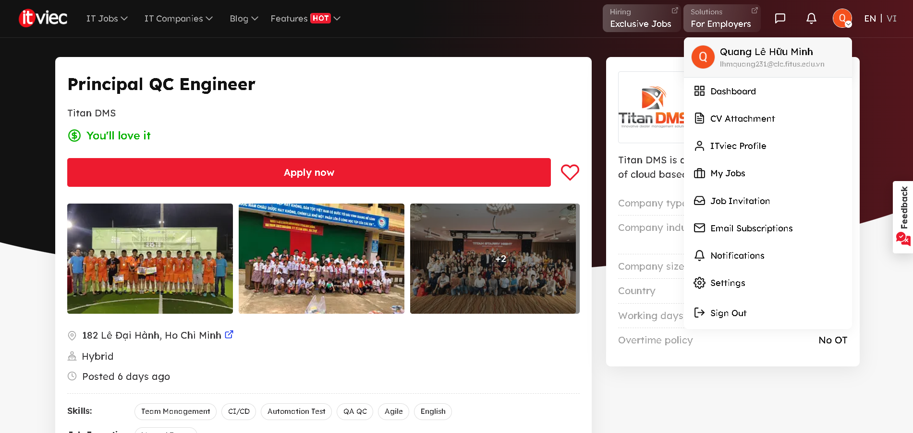
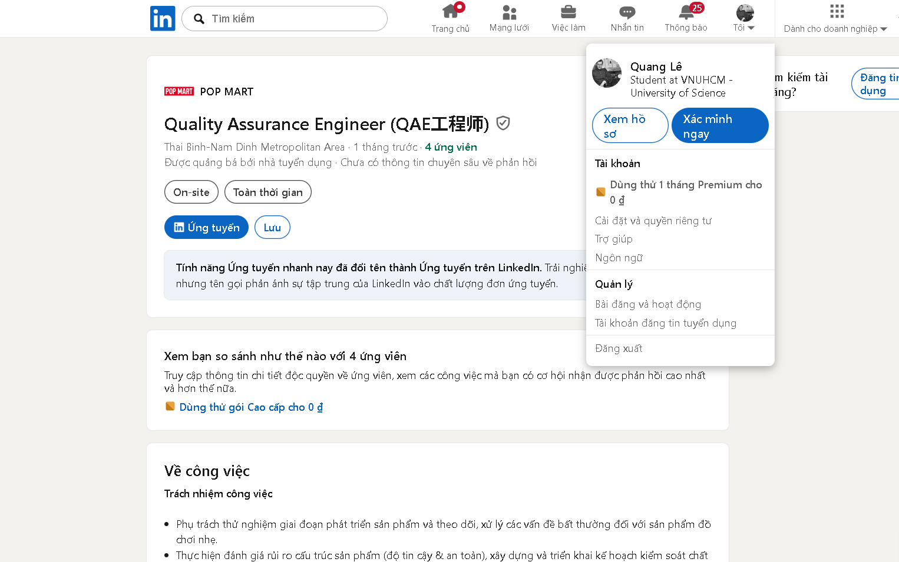
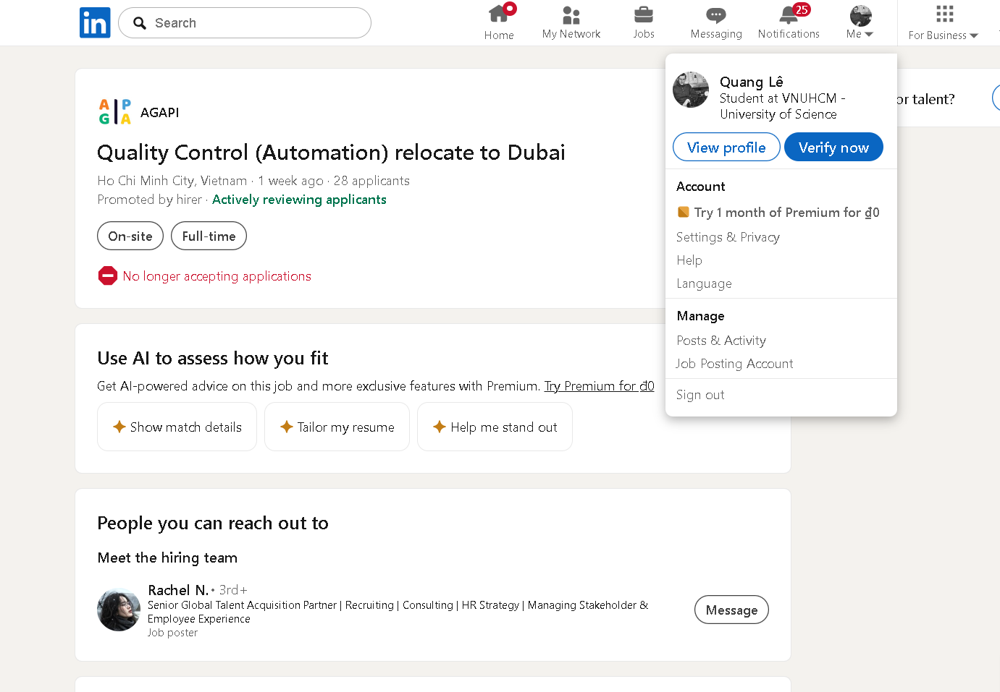
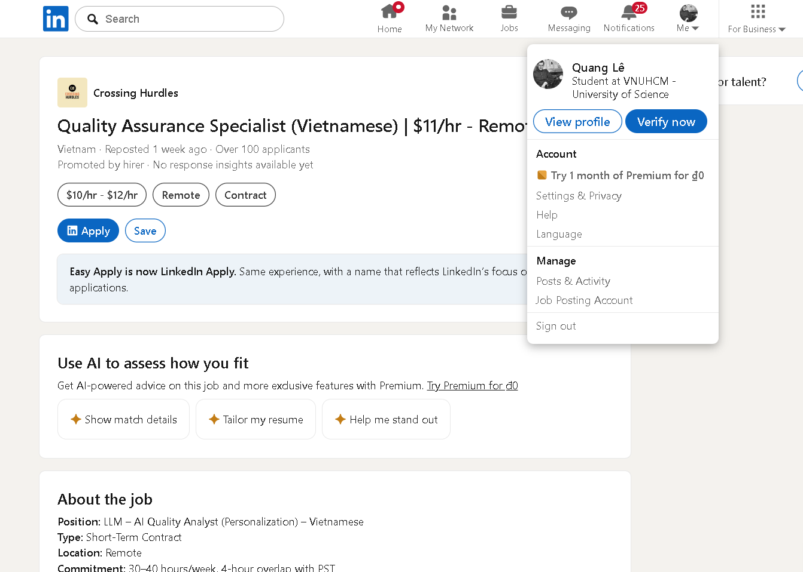
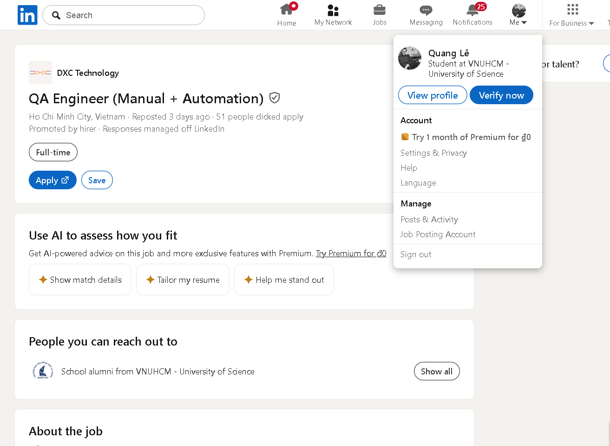
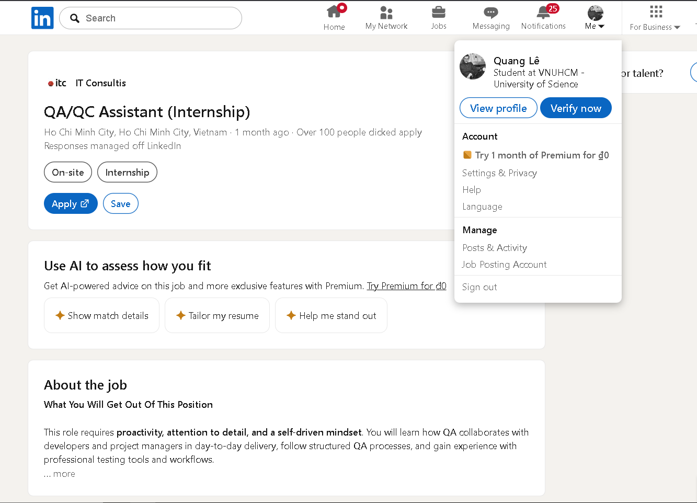
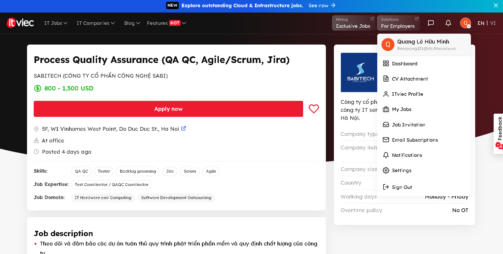
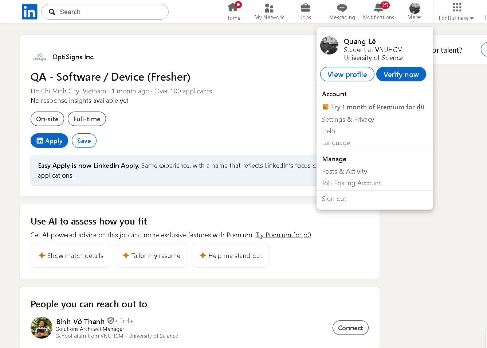
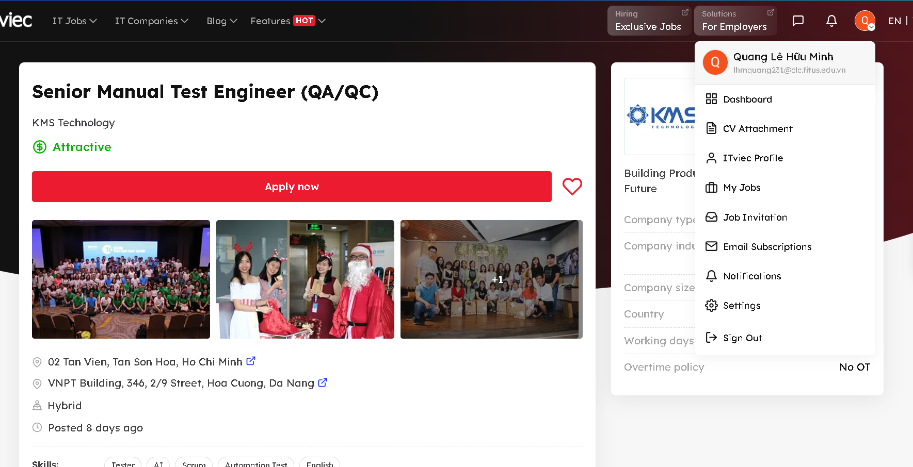
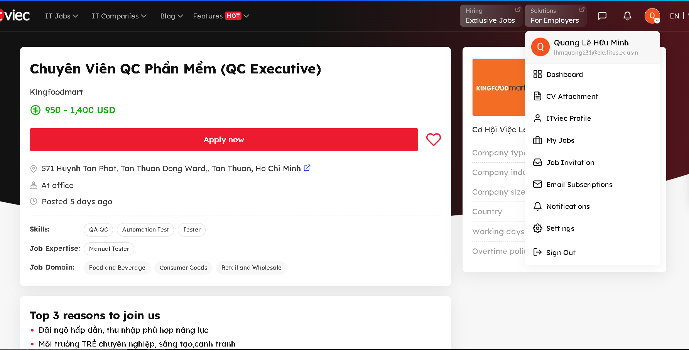

# BÁO CÁO BÀI TẬP HW01: QA/QC JOBS · 20 DEFECTS · TEST A PHYSICAL PRODUCT

* **Họ tên sinh viên:** Lê Hữu Minh Quang
* **MSSV:** 23127108
* **Repository Link:** **[Github](https://github.com/fgounlimitedluckgame/HW01-QA-QC-Jobs-20Defects-Test-a-Physical-Product)**

---

# Requirement 1: QA/QC Job Market 2026+

## Job 01: Principal QC Engineer - Titan DMS
- **Link:** [ITViec Job Posting](https://itviec.com/it-jobs/principal-qc-engineer-titan-dms-3614)
- **Hình minh chứng:** 
- **Mô tả công việc:**
  - Chịu trách nhiệm xây dựng chiến lược, tiêu chuẩn và quy trình kiểm thử (QC) tổng thể cho tổ chức.
  - Quản lý và giám sát hoạt động kiểm thử của 6 nhóm phát triển, dẫn dắt việc áp dụng các công cụ AI và Automation Test để tối ưu hóa hiệu suất.
  - Đảm bảo độ phủ kiểm thử toàn diện, bao gồm cả kiểm thử chức năng, hiệu năng và bảo mật.
  - Tổng hợp kết quả, xu hướng lỗi và lập báo cáo chất lượng cho ban lãnh đạo để quản lý rủi ro trước khi phát hành.
  - Đào tạo, định hướng và hỗ trợ phát triển chuyên môn cho các thành viên trong đội ngũ QC.
- **Yêu cầu kỹ năng chính:**
  - Có từ 7 năm kinh nghiệm trở lên trong lĩnh vực đảm bảo và kiểm soát chất lượng phần mềm (QA/QC).
  - Kinh nghiệm quản lý, dẫn dắt và cố vấn các đội ngũ QC trong môi trường Agile/Scrum.
  - Kiến thức chuyên sâu về chiến lược kiểm thử, quản lý lỗi và quy trình chất lượng.
  - Kinh nghiệm thực tế với các framework kiểm thử tự động và các công cụ ứng dụng AI (AI-assisted tools) để tối ưu hóa kết quả QC.
  - Có kinh nghiệm với các công cụ CI/CD và tư duy kiểm thử sớm.
  - Hiểu biết về các công cụ kiểm thử API, kiến trúc microservices và kiểm thử hồi quy.
  - Kỹ năng giao tiếp và viết tài liệu bằng tiếng Anh xuất sắc; có chứng chỉ ISTQB là một lợi thế.
- **Mức lương:** Thỏa thuận (Attractive Salary)
- **Phân tích tác động từ AI:** Vị trí lãnh đạo này chịu tác động mang tính chiến lược từ AI, khi ứng viên không chỉ sử dụng công cụ mà phải trực tiếp định hình và thúc đẩy các squad ứng dụng AI để tự động hóa việc tạo test case và phân tích lỗi nhằm giảm thiểu công việc thủ công.

## Job 02: Quality Assurance Engineer (QAE工程师) - POP MART
- **Link:** [LinkedIn Job Posting](https://www.linkedin.com/jobs/view/4408632083/?alternateChannel=search&trk=d_flagship3_search_srp_jobs&refId=PFCsMw2dh0WW3OtmJYf1tw%3D%3D&trackingId=d0WAmYSiwqY4QA7VvC8PiA%3D%3D)
- **Hình minh chứng:** 
- **Mô tả công việc:**
  - Phụ trách thử nghiệm trong giai đoạn phát triển sản phẩm, theo dõi và xử lý các vấn đề bất thường đối với sản phẩm đồ chơi nhẹ.
  - Thực hiện đánh giá rủi ro cấu trúc sản phẩm (về độ tin cậy và an toàn), xây dựng và triển khai các kế hoạch kiểm soát chất lượng.
  - Nghiên cứu, biên soạn các tiêu chuẩn chất lượng trong quá trình R&D và các tiêu chuẩn nội bộ của công ty.
  - Tổng hợp số liệu và lập báo cáo chất lượng định kỳ hàng tháng.
  - Hỗ trợ đào tạo kiến thức chuyên môn cho đội ngũ QAE và QC khi có yêu cầu.
- **Yêu cầu kỹ năng chính:**
  - Tốt nghiệp đại học trở lên, có ít nhất 3 năm kinh nghiệm trong lĩnh vực đảm bảo chất lượng đồ chơi hoặc các sản phẩm liên quan.
  - Am hiểu hệ thống quản lý chất lượng sản phẩm và các yêu cầu an toàn.
  - Nắm vững các tiêu chuẩn an toàn đồ chơi như GB 6675, ASTM F963, EN71; ưu tiên ứng viên có kinh nghiệm làm việc tại công ty kiểm định bên thứ ba.
  - Có khả năng phân tích độc lập nguyên nhân vấn đề chất lượng và đề xuất giải pháp hiệu quả.
  - Kỹ năng giao tiếp và làm việc nhóm tốt; có khả năng phối hợp hiệu quả với các phòng ban và nhà cung cấp.
  - Tinh thần trách nhiệm cao, khả năng thực thi tốt, thành thạo các phần mềm văn phòng.
- **Mức lương:** Thỏa thuận
- **Phân tích tác động từ AI:** Mặc dù đây là vị trí QC vật lý, AI (Computer Vision) có thể được ứng dụng để tự động hóa việc soi lỗi ngoại quan của đồ chơi trên dây chuyền, giúp QAE tập trung vào việc đánh giá rủi ro cấu trúc thay vì kiểm tra bằng mắt thường.

## Job 03: Quality Control (Automation) relocate to Dubai - AGAPI
- **Link:** [LinkedIn Job Posting](https://www.linkedin.com/jobs/view/4417854283/?eBP=CwEAAAGeb4Eq1qxJ5Drk3wyIarnc__E8L00T_H8XgAXzdWZdP-oZR0gPQWxezpQT6o-s5FVENaCJLetdMix9hhyD0ZCZZijtEllap4ygADjXDF3EnWLz4Xjq-DZ4UL3zkPODQj4T2WF52VgOATM2ZLjnt_2_-zq2HntEek-1LzEzjGYQgwZzP-gQNmEyy1iUWkpQGPh_Q9ZdGwPwrA2IWGjD4A3k4vnT_imPF4kSf3uL9fpBU5l37tgZyIVDFIKAdiIgX5fKXKhqSwmWU2Z2Slm_sY6y3eHhGoGN6xXWi79s9mricHTJfhb7xexzQ-uiuPFmUTu90R4MWARPyUY0pmNlo108n9JlTcf7v-OeeemV1C2o01E6UlRqrBv9mr_TipkJ240DUJmfbQ8lcTprhrQumZSgcbpe4Eh0ToaIVVH22yyZOCuCfLosoR6Xgh6OkQAZiLmHe0P4Gnx7-EiHb8Bx4iWiZ8b3clj5OtUhwwUSjAU&trk=flagship3_search_srp_jobs&refId=PFCsMw2dh0WW3OtmJYf1tw%3D%3D&trackingId=xi7to1a4WXGnyVo5XrST3A%3D%3D)
- **Hình minh chứng:** 
- **Mô tả công việc:**
  - Thiết kế, phát triển và duy trì các kịch bản kiểm thử tự động nhằm xác thực chức năng, tính bảo mật và hiệu năng của hệ thống thanh toán.
  - Triển khai các framework kiểm thử cho các quy trình giao dịch thanh toán (bao gồm thẻ tín dụng và tiền điện tử cryptocurrency).
  - Phối hợp chặt chẽ với đội ngũ Development và DevOps để tích hợp các bài test tự động vào luồng CI/CD.
  - Thực hiện kiểm thử hiệu năng (performance, load, stress testing) để xác định các bottlenecks và lỗ hổng.
  - Phân tích lỗi, theo dõi quá trình sửa lỗi và chạy kiểm thử hồi quy để đảm bảo độ ổn định cho các bản phát hành.
- **Yêu cầu kỹ năng chính:**
  - Có từ 3 năm kinh nghiệm trở lên trong lĩnh vực kiểm thử tự động (QA Automation), tập trung vào các hệ thống thanh toán.
  - Thành thạo các framework automation phổ biến như Selenium, Appium kèm kinh nghiệm sử dụng các ngôn ngữ lập trình (Java, Python, hoặc JavaScript).
  - Kinh nghiệm tích hợp các kịch bản kiểm thử tự động vào đường ống CI/CD (Jenkins, GitLab CI, hoặc tương đương).
  - Có kiến thức sử dụng các công cụ kiểm thử hiệu năng, tải và áp lực hệ thống như JMeter, LoadRunner, hoặc Gatling.
  - Am hiểu về các cổng thanh toán (payment gateways), tích hợp bên thứ ba, quy trình xử lý thẻ tín dụng và hệ thống tiền điện tử (cryptocurrency).
  - Hiểu biết về các giao thức bảo mật, tiêu chuẩn tuân thủ dữ liệu (PCI-DSS, GDPR) và kiến thức về kiểm thử lỗ hổng bảo mật.
  - Kinh nghiệm kiểm thử API (Postman, REST Assured) và sử dụng hệ thống quản lý phiên bản Git trong môi trường Agile/Scrum.
- **Mức lương:** Thỏa thuận (Lương cao miễn thuế tại Dubai)
- **Phân tích tác động từ AI:** Vị trí kiểm thử tự động hệ thống thanh toán này sẽ được tối ưu hóa mạnh mẽ nhờ AI thông qua khả năng tự động sinh mã kịch bản kiểm thử (test script generation) cho các luồng giao dịch phức tạp, đồng thời ứng dụng học máy để phát hiện sớm các lỗ hổng bảo mật và thắt nút cổ chai hiệu năng trong các hệ thống xử lý giao dịch lớn.

## Job 04: Quality Assurance Specialist (Vietnamese) - Crossing Hurdles
- **Link:** [LinkedIn Job Posting](https://www.linkedin.com/jobs/view/4376739289/?eBP=CwEAAAGeb4Eq1vUhmVF7QBFrp2mRtKvIiVUF3Gd57HkSisxvEarL_sjx_WSDb46UkGCOEI86fC3KTqzRbPA2Ui1YgMXxekzoeIz3VicLqNqZFdfAJYqQRdqyB6DvJYtyCG8LkvFa6_9KhlgAjpsJmQdalLdaeHEUIamhCe0N32VN1RAKbhbmWJdwqSJNG7UMHT1qb4pzsTQe1ooH20d-ZcJSR4pRf2mb2-X1AsnD4Qt0wnSiSDvqvKxbDC3lU3BX7tHIRqj4MZGdFahFE_3k-qf1x8RSWQ1gJEVAdG0OctKQhIY3Cf4BISCVPsQ3Y2FVuuDpdg1M6YMOfn0M15_V6lJ2rb-zLN3ksIc9GGBtwyQZ7EiHfCPszwNED-oQqmC0BOaEU7U29WpdezAK5ugwQu8EI1rt5elot78aNzKZitTpFevrTl2gSEUje5wCBNpfZs0nnZvcg9nfOZEhHIMqQxnh97ja0oXsZ7cQJi3pcTL_H4vZnQ&trk=flagship3_search_srp_jobs&refId=PFCsMw2dh0WW3OtmJYf1tw%3D%3D&trackingId=O8Fo%2FTyv1MLH9uQBdE%2ByDw%3D%3D)
- **Hình minh chứng:** 
- **Mô tả công việc:**
  - Thiết kế các kịch bản hội thoại nhiều lượt (multi-turn prompts) tận dụng thông tin ngữ cảnh cá nhân hóa của người dùng.
  - Đánh giá chất lượng các câu trả lời của AI dựa trên độ bám sát dữ liệu, sự tự nhiên và mức độ hữu ích.
  - Phát hiện các lỗi sai trong suy luận, hiện tượng "ảo giác" (hallucinations) hoặc việc sử dụng sai dữ liệu nguồn cá nhân.
  - Đánh giá song song (SxS evaluation) và xếp hạng chất lượng đầu ra của các mô hình ngôn ngữ khác nhau.
  - Viết báo cáo, giải thích chi tiết các lỗi cá nhân hóa và quản lý vệ sinh dữ liệu bảo mật bằng cách xóa các log đánh giá.
- **Yêu cầu kỹ năng chính:**
  - Thành thạo tiếng Việt (nghe, nói, đọc, viết) đáp ứng yêu cầu làm việc.
  - Kinh nghiệm dày dặn trong việc gán nhãn dữ liệu, đánh giá chất lượng AI, điều phối nội dung hoặc các vai trò tương đương.
  - Kỹ năng phân tích tốt để đánh giá các kết quả đầu ra có tính mơ hồ hoặc có sắc thái phức tạp của AI.
  - Kinh nghiệm prompt engineering và xây dựng các kịch bản hội thoại nhiều lượt (multi-turn conversations).
  - Hiểu biết sâu về khái niệm cá nhân hóa và các phương pháp đánh giá phản hồi của mô hình AI.
  - Chú ý cao đến chi tiết để thực hiện so sánh, đánh giá song song (SxS comparisons) và xếp hạng các phản hồi của mô hình.
  - Sẵn sàng sử dụng tài khoản Google cá nhân để tích hợp và kiểm thử các nguồn dữ liệu cá nhân hóa.
- **Mức lương:** 11 USD / giờ (Remote)
- **Phân tích tác động từ AI:** Đây là một vị trí công việc hoàn toàn mới được sinh ra từ làn sóng AI, nơi con người đóng vai trò cốt lõi trong quy trình RLHF nhằm đánh giá tính chính xác, phát hiện ảo tưởng (hallucination) và tinh chỉnh khả năng cá nhân hóa của các mô hình ngôn ngữ lớn (LLM).

## Job 05: QA Engineer (Manual + Automation)  - DXC Technology
- **Link:** [LinkedIn Job Posting](https://www.linkedin.com/jobs/view/4402151198/?eBP=CwEAAAGeb4Eq1gM6VDBzXqUTol9fOmEm1kIK49RgnUzTrMEkNvOvlJa-Bd3jv95WQ0svqMje8kpeIe9jdjC2fPpyQjm4R6O-7sWDTtNULzD2K5-KcSympK7hGemrMSLTLbns4cPurGgaVmiJW39P0UIRBLS4zISySyZci-TCH6p3Du3mh1ANDTapdRT4YilzkU59PbypF5QC5g8NTInd7z0VHJSrCUINZQuhR2UGtKzk5KLUt5Yq_93mAdE3TsMof1KUlx1xn_udfkMbbfI_SlmQC1CmOSUbjWjWhm6STxUJkucnakhqg-2dZVaSf5NsG2iPZwleQtaDizwk_NYdPph5LVxSAf-JRyjed57cuMF3tIotmBTXeFUaOEdKXV_AAmWhGV2Upl8yC13nV4hUarRsb5lRtBoObznTLOGvv4u0ikmhklAijdfW1vaZBXQJhbs7G7apHb5BZHmZLV1Gv8oTEqbIlY8NIenuJ7J6X6WXX6XnJA&trk=flagship3_search_srp_jobs&refId=PFCsMw2dh0WW3OtmJYf1tw%3D%3D&trackingId=Py87MZjGTj0uxUFLi0CPdQ%3D%3D)
- **Hình minh chứng:** 
- **Mô tả công việc:**
  - Phân tích yêu cầu nghiệp vụ để tạo ra các Test Plan, Test Cases và kịch bản kiểm thử chi tiết.
  - Thực hiện kiểm thử thủ công (functional, regression, smoke, UAT) cho các ứng dụng Web và Mobile.
  - Duy trì và thực thi các kịch bản kiểm thử tự động sử dụng phần mềm Katalon Studio và TestComplete.
  - Ghi nhận, theo dõi và quản lý vòng đời của các lỗi phần mềm trên Jira cùng với đội ngũ phát triển.
  - Kiểm thử API cơ bản bằng Postman/Katalon và đóng góp các cải tiến cho quy trình cũng như tài liệu QA.
- **Yêu cầu kỹ năng chính:**
  - Có từ 3 năm kinh nghiệm trở lên trong lĩnh vực kiểm thử QA, có thế mạnh về kiểm thử thủ công (manual testing - functional, regression, integration).
  - Hiểu biết vững chắc về vòng đời phát triển phần mềm (SDLC), vòng đời kiểm thử phần mềm (STLC) và các quy trình QA tiêu chuẩn.
  - Kinh nghiệm thực tế về kiểm thử tự động (test automation), cụ thể với Katalon Studio (Groovy/Java) và/hoặc TestComplete (JavaScript / VBScript / Python).
  - Kinh nghiệm kiểm thử API sử dụng Postman hoặc Katalon (REST); có kiến thức cơ bản về SQL là một lợi thế lớn.
  - Trình độ tiếng Anh trung cấp (Intermediate), có kỹ năng giao tiếp và làm việc nhóm tốt.
  - Cẩn thận, có tư duy phân tích tốt và sẵn sàng cân bằng giữa các tác vụ kiểm thử thủ công và tự động.
- **Mức lương:** Thỏa thuận (Attractive Salary)
- **Phân tích tác động từ AI:** Vị trí kết hợp Manual và Automation này sẽ được nâng cao hiệu suất đáng kể nhờ AI; các mô hình sinh mã tự động có thể hỗ trợ kỹ sư viết nhanh các hàm và custom keywords bằng Groovy hoặc Python trong Katalon/TestComplete, rút ngắn thời gian chuyển đổi từ test case thủ công sang kịch bản tự động.

## Job 06: QA/QC Assistant (Internship) - IT Consultis
- **Link:** [LinkedIn Job Posting](https://www.linkedin.com/jobs/view/4395996253/?eBP=NOT_ELIGIBLE_FOR_CHARGING&trk=flagship3_search_srp_jobs&refId=PFCsMw2dh0WW3OtmJYf1tw%3D%3D&trackingId=DNWZ6SQjZYTrHtHHYKJp2Q%3D%3D)
- **Hình minh chứng:** 
- **Mô tả công việc:**
  - Hỗ trợ đội ngũ QA/QC thực thi các kịch bản test case cho ứng dụng web và nền tảng thương mại điện tử.
  - Trực tiếp kiểm thử thủ công các luồng người dùng cốt lõi như đăng nhập, tìm kiếm sản phẩm, giỏ hàng và thanh toán.
  - Xác định, tái hiện lại các lỗi và ghi chép tài liệu rõ ràng vào các công cụ quản lý dự án (Jira, ClickUp).
  - Hỗ trợ kiểm thử hồi quy sau khi tính năng mới được phát hành hoặc lỗi đã được sửa.
  - Tham gia hỗ trợ nghiệm thu trên môi trường staging/UAT và hỗ trợ chuẩn bị các báo cáo kiểm thử định kỳ.
- **Yêu cầu kỹ năng chính:**
  - Sinh viên năm cuối hoặc mới tốt nghiệp chuyên ngành CNTT, Khoa học Máy tính, Kỹ thuật Phần mềm hoặc các ngành liên quan.
  - Có nền tảng và hiểu biết cơ bản về các khái niệm kiểm thử phần mềm (manual testing, thiết kế test case, quy trình theo dõi bug, UAT/SIT).
  - Khả năng đọc hiểu mã nguồn cơ bản (HTML/CSS, logic JavaScript cơ bản) để hỗ trợ kiểm thử giao diện và tìm lỗi.
  - Khả năng đọc hiểu tốt các tài liệu yêu cầu kỹ thuật hoặc yêu cầu chức năng.
  - Tỉ mỉ, chú ý đến chi tiết, có tư duy chủ động và tinh thần sẵn sàng học hỏi.
  - Thành thạo tiếng Anh với kỹ năng đọc và viết tốt.
  - Điểm cộng nếu quen thuộc với các công cụ quản lý và kiểm thử như Jira, ClickUp, Postman, Browser Developer Tools hoặc hiểu biết về Agile/Scrum.
- **Mức lương:** Thỏa thuận (Competitive salary package)
- **Phân tích tác động từ AI:** Vị trí thực tập sinh này sẽ chịu tác động tích cực từ AI thông qua việc sử dụng các trợ lý mã nguồn để hiểu nhanh các tài liệu kỹ thuật phức tạp hoặc gợi ý dữ liệu mẫu, nhưng việc thực thi thủ công trực tiếp trên các luồng nghiệp vụ cốt lõi (như login, checkout, payment) của hệ thống thương mại điện tử vẫn đòi hỏi sự cẩn thận và tư duy logic mà AI chưa thể tự quyết định hoàn toàn.

## Job 07: Process Quality Assurance (QA QC, Agile/Scrum, Jira)
- **Link:** [ITViec Job Posting](https://itviec.com/it-jobs/process-quality-assurance-qa-qc-agile-scrum-jira-sabitech-cong-ty-co-phan-cong-nghe-sabi-1415?lab_feature=preview_jd_page)
- **Hình minh chứng:** 
- **Mô tả công việc:**
  - Theo dõi và đảm bảo các dự án tuân thủ quy trình phát triển phần mềm và quy định chất lượng của công ty.
  - Phối hợp với PM/Team để kiểm soát tiến độ, chất lượng và quản lý các rủi ro trong quá trình triển khai dự án.
  - Theo dõi task, timeline, quality checkpoints và hỗ trợ thúc đẩy dự án vận hành đúng kế hoạch.
  - Hỗ trợ kiểm tra, đánh giá process compliance và đề xuất cải tiến nhằm nâng cao hiệu quả vận hành dự án.
  - Hỗ trợ triển khai, đào tạo và duy trì các quy trình nội bộ, tiêu chuẩn chất lượng trong công ty.
  - Phối hợp với các bộ phận liên quan để nâng cao chất lượng sản phẩm và tối ưu quy trình làm việc.
- **Yêu cầu kỹ năng chính:**
  - Có từ 1 năm kinh nghiệm ở vị trí PQA/QA/Project Coordinator trong công ty công nghệ hoặc IT outsourcing.
  - Hiểu quy trình phát triển phần mềm và mô hình Agile/Scrum.
  - Có kỹ năng theo dõi tiến độ, quản lý công việc, tổng hợp và phân tích dữ liệu báo cáo.
  - Kỹ năng giao tiếp, phối hợp và xử lý công việc tốt.
  - Có khả năng làm việc với nhiều team và phối hợp xử lý vấn đề hiệu quả.
  - Thành thạo Excel/Google Sheet; có kinh nghiệm sử dụng Backlog, Jira, Redmine hoặc các công cụ quản lý dự án là lợi thế.
  - Chủ động, cẩn thận, có tư duy hệ thống và tinh thần cải tiến quy trình.
  - Biết tiếng Nhật hoặc có kinh nghiệm làm việc với thị trường Nhật Bản là lợi thế.
- **Mức lương:** 800 - 1,300 USD
- **Phân tích tác động từ AI:** Vị trí này chịu tác động tích cực từ AI khi việc theo dõi dự án, phối hợp với PM/Team, hỗ trợ kiểm tra, đánh giá từ việc phải tự làm bằng tay, giờ đây đã có AI tự động hoá quá trình giúp tăng hiệu năng làm việc.

## Job 08: QA - Software / Device (Fresher) - OptiSigns Inc.
- **Link:** [LinkedIn Job Posting](https://www.linkedin.com/jobs/view/4413964352/?eBP=NOT_ELIGIBLE_FOR_CHARGING&trk=flagship3_search_srp_jobs&refId=PFCsMw2dh0WW3OtmJYf1tw%3D%3D&trackingId=ubVuDwbr0k6VdUVazdycZA%3D%3D)
- **Hình minh chứng:** 
- **Mô tả công việc:**
  - Tiến hành các bài kiểm thử chức năng, kiểm thử hồi quy và kiểm thử khám phá trên nền tảng ứng dụng web và thiết bị phần cứng.
  - Log lỗi hệ thống chi tiết bao gồm các bước tái hiện, tài liệu kỹ thuật, log file và ảnh chụp màn hình.
  - Xây dựng, bảo trì danh sách các test cases; theo dõi và hỗ trợ thực hiện các kịch bản kiểm thử nhanh (smoke/sanity runs).
  - Hợp tác chặt chẽ với đội ngũ kỹ sư phần mềm để xác minh lỗi đã fix và tăng cường độ phủ kiểm thử.
- **Yêu cầu kỹ năng chính:**
  - Sinh viên mới tốt nghiệp chuyên ngành Khoa học Máy tính, Kỹ thuật hoặc các ngành liên quan.
  - Cẩn thận, có tinh thần tò mò, nhạy bén và đam mê học hỏi các kiến thức, quy trình kiểm thử nền tảng.
  - Có khả năng viết script cơ bản hoặc có kiến thức về truy vấn SQL là một lợi thế lớn.
  - Thành thạo tiếng Anh chuyên nghiệp phục vụ công việc.
  - Khả năng phối hợp tốt với các kỹ sư phát triển để xác minh lỗi và nâng cao độ phủ kiểm thử.
- **Mức lương:** Cạnh tranh (Competitive Pay)
- **Phân tích tác động từ AI:** Vị trí Fresher QA kiểm thử tích hợp ứng dụng và thiết bị phần cứng này sẽ được AI hỗ trợ đắc lực trong việc tự động hóa các kịch bản kiểm thử hồi quy và tạo kịch bản khói (smoke/sanity test), giúp nhân sự fresher giảm bớt tác vụ thủ công lặp lại để tập trung học hỏi sâu hơn về kiểm thử khám phá trên thực tế.

## Job 09: Senior Manual Test Engineer (QA/QC) - KMS Technology
- **Link:** [ITViec Job Posting](https://itviec.com/it-jobs/senior-manual-test-engineer-qa-qc-kms-technology-3100?lab_jr_age=181-225%27&lab_vjr_frequency=vjr-2xweek%2Fdanh-gia%3Fpage%3D1&lab_feature=preview_jd_page)
- **Hình minh chứng:** 
- **Mô tả công việc:**
  - Trực tiếp thực thi các tác vụ kiểm thử hộp đen, thăm dò và xử lý rủi ro để tối ưu hóa mức độ che phủ lỗi và nâng cao trải nghiệm ứng dụng Web.
  - Chủ động đề xuất các phương pháp tiếp cận QA có hệ thống, cải thiện chất lượng từ gốc để giảm thiểu lỗi trong quá trình vận hành sản phẩm.
  - Tham gia lập kế hoạch Sprint, phân tích requirement với đội Scrum nhằm định hình chiến lược kiểm thử khả thi cho từng giai đoạn.
  - Tích cực tham gia các sáng kiến thúc đẩy tăng trưởng sản phẩm như phân tích đối thủ, troubleshooting vấn đề khách hàng gặp phải.
  - Dẫn dắt, hướng dẫn và truyền đạt kiến thức chuyên môn cho các kỹ sư QA cấp dưới trong dự án.
- **Yêu cầu kỹ năng chính:**
  - Tốt nghiệp Cử nhân chuyên ngành Khoa học Máy tính, Công nghệ thông tin hoặc các lĩnh vực liên quan.
  - Có từ 5 năm kinh nghiệm thực tế trở lên trong lĩnh vực kiểm thử phần mềm, ưu tiên kinh nghiệm với các ứng dụng nền tảng Web.
  - Kinh nghiệm dày dặn trong việc dẫn dắt, cố vấn và chia sẻ các phương pháp kiểm thử tối ưu cho các kỹ sư QA cấp dưới.
  - Nền tảng vững chắc về quy trình chất lượng (chiến lược test, phương pháp tiếp cận, kiểm thử hộp đen, kiểm thử dựa trên rủi ro, kiểm thử khám phá và kiểm thử Non-UI).
  - Hiểu biết sâu sắc về vòng đời phát triển phần mềm (SDLC) và vòng đời kiểm thử phần mềm (STLC) trong môi trường Agile/Scrum.
  - Trình độ tiếng Anh trung cấp trở lên, sở hữu kỹ năng giao tiếp và phối hợp liên chức năng xuất sắc.
  - **Điểm cộng lớn về AI:** Sử dụng thành thạo hàng ngày các công cụ mã nguồn AI (Copilot, Cursor, Claude Code); có khả năng áp dụng kỹ thuật prompting nâng cao (chain-of-thought, multi-step prompting); có kinh nghiệm làm việc với kiến trúc AI Agent hoặc tích hợp hệ thống AI qua giao thức MCP.
- **Mức lương:** Thỏa thuận (Attractive Salary and Benefits)
- **Phân tích tác động từ AI:** Đây là một vị trí QA cao cấp đòi hỏi tư duy làm việc đồng hành cùng AI một cách toàn diện; thay vì viết kịch bản tự động hóa truyền thống, kỹ sư sẽ chịu trách nhiệm thiết kế và điều phối các hệ thống AI Agent (agentic workflow) để tối ưu hóa toàn bộ vòng đời kiểm thử, dịch chuyển vai trò kiểm thử thông thường thành kỹ sư giám sát và kiến trúc chất lượng tích hợp AI.

## Job 10: Chuyên Viên QC Phần Mềm (QC Executive) - Kingfoodmart
- **Link:** [ITViec Job Posting](https://itviec.com/it-jobs/chuyen-vien-qc-phan-mem-qc-executive-kingfoodmart-0249?lab_jr_age=181-225%27&lab_vjr_frequency=vjr-2xweek%2Fdanh-gia%3Fpage%3D1&lab_feature=preview_jd_page)
- **Hình minh chứng:** 
- **Mô tả công việc:**
  - Lập kế hoạch kiểm tra tổng thể, chuẩn bị chi tiết các bộ kịch bản (test cases) và tiến hành kiểm thử các mô-đun phần mềm mới.
  - Thực hiện test, log lỗi lên hệ thống quản lý và giám sát tiến độ khắc phục lỗi của đội ngũ phát triển.
  - Quản lý vòng đời của các sự cố phát sinh, theo dõi sát sao tình hình vận hành các chức năng quản trị doanh nghiệp.
  - Phối hợp chặt chẽ với các đội lập trình viên (backend, web, mobile) và thiết kế sản phẩm để làm rõ yêu cầu.
  - Bảo vệ chất lượng cuối cùng, đảm bảo sản phẩm được đưa lên môi trường thật luôn khớp với thiết kế đã thống nhất.
- **Yêu cầu kỹ năng chính:**
  - Có kinh nghiệm thực tế trong việc kiểm thử các hệ thống ERP (hoặc các hệ thống quản trị doanh nghiệp phức tạp tương đương).
  - Kỹ năng phân tích logic tốt, có khả năng dự đoán các tình huống, kịch bản (Edge cases) có thể gây lỗi hệ thống.
  - Nắm vững các kiến thức, quy trình và kỹ thuật kiểm thử phần mềm (Functional, Regression, Integration, API Testing,...).
  - Biết sử dụng các công cụ AI tối ưu hóa việc viết test case, tạo dữ liệu mẫu (mock data) hoặc hỗ trợ viết script test.
  - Kỹ năng viết bug, rõ ràng, lắng nghe và truyền đạt thông tin hiệu quả giữa các bên (Dev, Product, QA).
  - Chủ động cập nhật các xu hướng công nghệ, công cụ và quy trình kiểm thử mới để nâng cao hiệu suất công việc.
  - Có kinh nghiệm hoặc khả năng viết kịch bản kiểm thử tự động (Automation Test) sử dụng TypeScript với các công cụ Playwright (cho Web) và Appium (cho Mobile) là một lợi thế lớn.
  - Kỹ năng học hỏi nhanh và chủ động cập nhật các xu hướng công nghệ.
- **Mức lương:** 950 - 1,400 USD
- **Phân tích tác động từ AI:** Vị trí này đòi hỏi khả năng ứng dụng AI một cách thiết thực vào quy trình kiểm thử hệ thống quản trị doanh nghiệp (ERP); công cụ AI sẽ hỗ trợ kỹ sư tối ưu hóa việc thiết kế test case, tự động tạo các tập dữ liệu mẫu (mock data) quy mô lớn và đẩy nhanh tốc độ viết kịch bản tự động hóa bằng TypeScript (Playwright/Appium), giúp giải phóng thời gian để tập trung vào việc phân tích logic và dự đoán các kịch bản biên (edge case) phức tạp.

## QA/QC role mindmap và lỗi sai của AI

Ảnh AI tạo ra:

Các lỗi sai:

1. Lỗi Hiển thị: 
- Tại nhánh **CÔNG CỤ (QC)** `Jira` được viết bình thường trong khi tại **CÔNG CỤ (QA)** thì được viết all caps
2. Lỗi nghiệp vụ: `Giám sát quy trình phát triển (SDLC)` nằm tại phần **NHIỆM VỤ CHÍNH** của **QA**
- SDLC là một quy trình, framework mà QA vận hành theo, không phải là một nhiệm vụ 
3. Lỗi nghiệp vụ: `Kiểm thử thủ công (Manual Testing) và Kiểm thử tự động (Automatic testing)` nằm tại phần **NHIỆM VỤ CHÍNH** của **QC**
- Đây không phải là một nhiệm vụ mà là một kĩ năng, nhiệm vụ thì đã được trình bày sẵn trước đó là `Thực thi test cases`
- Tại phần **KỸ NĂNG** của **QC**, `Kỹ năng kiểm thử` chính là dòng mô tả này, dẫn đến việc trùng lắp mô tả giữa hai phần. Nên bỏ phần này ra khỏi phần **NHIỆM VỤ CHÍNH**
4. Lỗi trình bày: `(Kiểm soát tài liệu, theo dõi quy trình)` nằm tại phần **CÔNG CỤ** của **QA**
- Mô tả này chỉ nói chung chung về loại công cụ mà QA sẽ dùng chứ không phải là một tên của một công cụ cụ thể

---

# Requirement 2: 20 Software Defects 2022-2026
*Danh sách 20 lỗi phần mềm (trong đó có 5 lỗi liên quan đến AI/LLM).* 

## Defect 01: Chatbot Microsoft Copilot (Bing Chat) – Lỗi Prompt Injection (2023)
- **Nguồn:** [arstechnica.com](https://arstechnica.com/information-technology/2023/02/ai-powered-bing-chat-spills-its-secrets-via-prompt-injection-attack/)
- **Mô tả:** Người dùng và các chuyên gia bảo mật phát hiện hệ thống dễ bị tấn công phản hồi (Prompt Injection). Bằng cách chèn các câu lệnh ẩn vào các trang web mà chatbot đọc dữ liệu, kẻ tấn công có thể ghi đè lên bộ quy tắc an toàn (System Prompt) ban đầu của mô hình.
- **Mức độ:** Cao
- **Hậu quả:** Chatbot bị thao túng để tiết lộ các thông tin nội bộ của hệ thống.
- **Giải pháp:** Phân tách nghiêm ngặt dữ liệu đầu vào của người dùng (User input) và chỉ thị hệ thống (System instructions); triển khai bộ lọc ngữ nghĩa (semantic filtering) kiểm tra chéo nội dung trước khi trả kết quả.
- **Nơi AI bị ảo tưởng:** AI cho rằng lỗi Bing Chat được công bố vào năm 2024 nhưng thực chất là năm 2023, và AI đã lấy một nguồn sai để kết luận: [cio.com](https://www.cio.com/article/3624552/8-major-it-disasters-of-2024.html)
- **Đề xuất sửa:** Sửa lại năm công bố và link được cho ban đầu

## Defect 02: Chatbot Air Canada – Lỗi Ảo tưởng / Sai lệch thông tin (Hallucination) (2024)
- **Nguồn:** [sgsolutionsgroup.com](https://sgsolutionsgroup.com/real-world-ai-failures/)
- **Nguồn bổ sung:** [arstechnica.com](https://arstechnica.com/tech-policy/2024/02/air-canada-must-honor-refund-policy-invented-by-airlines-chatbot/)
- **Nguồn tham khảo chính sách của Air Canada:** [aircanada.com](https://www.aircanada.com/ca/en/aco/home/plan/special-assistance/bereavement-fares.html#/)
- **Mô tả:** Hệ thống chatbot AI chăm sóc khách hàng của hãng hàng không Air Canada đã tự "bịa" ra một chính sách giảm giá vé cho hành khách có người thân qua đời (bereavement policy) trái ngược với chính sách thực tế của hãng
- **Mức độ:** Cao
- **Hậu quả:** Hãng bay bị kiện ra tòa và thẩm phán phán quyết Air Canada phải bồi thường tiền mặt cho khách hàng vì lỗi do AI của hãng gây ra. Uy tín thương hiệu bị ảnh hưởng.
- **Giải pháp:** Giới hạn phạm vi phản hồi của AI bằng kiến trúc RAG (Retrieval-Augmented Generation) nghiêm ngặt; buộc AI chỉ trích dẫn trực tiếp từ cơ sở dữ liệu (Knowledge Base) chính thức và không cho phép tự suy diễn.
- **Nơi AI bị ảo tưởng:** AI ban đầu nói chính sách giảm giá vé của người thân "... không hề tồn tại trên thực tế". Thực chất, chính sách này có tồn tại, nhưng điểm khác biệt rằng chính sách này chỉ được dàn xếp qua điện thoại, và nghiên cấm việc hoàn tiền sau chuyến bay 
- **Đề xuất sửa:** thay đổi mô tả từ "... không hề tồn tại trên thực tế." thành "... trái ngược với chính sách thực tế của hãng"

## Defect 03: Hệ thống đặt đồ ăn tự động của Taco Bell – Lỗi Biên dữ liệu (Edge Case Logic) (2025)
- **Nguồn:** [testdevlab.com](https://www.testdevlab.com/blog/software-bugs-2025)
- **Mô tả:** Hệ thống AI nhận diện giọng nói đặt đồ ăn tại các lối đi Drive-thru gặp lỗi logic xử lý âm thanh môi trường và từ ngữ lạ (edge cases).
- **Mức độ:** Trung bình
- **Hậu quả:** Một người dùng đã thử đặt 18,000 ly nước như một trò đùa và đã làm sập hệ thống, gây tắc nghẽn chuỗi vận hành và làm khách hàng giận dữ.
- **Giải pháp:** Thiết lập hạn mức logic tối đa cho mỗi đơn hàng; cải thiện mô hình lọc nhiễu âm thanh môi trường.
- **Nơi AI bị ảo tưởng:** Ban đầu AI có bảo rằng đây là hệ thống đặt đồ ăn tự động của Taco Bell lẫn McDonalds trong khi nó chỉ là của Taco Bell. AI cho rằng hậu quả bao gồm việc đặt chục phần kem hoặc hàng trăm miếng gà trong khi nó là 18,000 ly nước
- **Đề xuất sửa:** Sửa tiêu đề thành "Hệ thống đặt đồ ăn tự động của Taco Bell – Lỗi Biên dữ liệu (Edge Case Logic) (2025)", thay đổi thông tin đơn hàng từ chục phần kem và hàng trăm miếng gà thành 18,000 ly nước

## Defect 04: Hệ thống gợi ý thực đơn "Savey Meal Bot" – Lỗi Logic & Thiếu bộ lọc an toàn (Safety Filter Defect) (2023)
- **Nguồn:** [sgsolutionsgroup.com](https://sgsolutionsgroup.com/real-world-ai-failures/)
- **Nguồn bổ sung:** [theguardian.com](https://www.theguardian.com/world/2023/aug/10/pak-n-save-savey-meal-bot-ai-app-malfunction-recipes)
- **Mô tả:** Chatbot AI của chuỗi siêu thị Pak'nSave (New Zealand) được thiết kế để gợi ý món ăn từ nguyên liệu thừa. Tuy nhiên, thuật toán thiếu bộ lọc hóa chất độc hại.
- **Mức độ:** Cao
- **Hậu quả:** Khi người dùng nhập ngẫu nhiên một số nguyên liệu từ gia đình, AI đã gợi ý công thức tạo ra khí clo độc hại (gọi là mocktail) và một vài công thức món ăn chết người khác.
- **Giải pháp:** Tích hợp danh sách đen (Blacklist) các chất cấm nguy hiểm; áp dụng mô hình Guardrails (lớp kiểm định an toàn) để quét đầu ra (output) của AI trước khi hiển thị cho người dùng.
- **Nơi AI bị ảo tưởng:** AI nói rằng khí clo độc hại là "nước thơm giải khát" trong khi mocktail là định nghĩa về một trong những loại đồ uống không chứa cồn thường được sử dụng trong các lễ hội
- **Đề xuất sửa:** Sửa "nước thơm giải khát" thành mocktail

## Defect 05: Chatbot của Đại lý Chevrolet – Lỗi Thao túng ngữ cảnh (Context Manipulation) (2024)
- **Nguồn:** [sgsolutionsgroup.com](https://sgsolutionsgroup.com/real-world-ai-failures/)
- **Nguồn bổ sung:** [businessinsider.com](https://www.businessinsider.com/car-dealership-chevrolet-chatbot-chatgpt-pranks-chevy-2023-12)
- **Nguồn bổ sung 2:** [cybernews.com](https://cybernews.com/ai-news/chevrolet-dealership-chatbot-hack/)
- **Mô tả:** Đại lý xe Chevrolet tại California triển khai chatbot dựa trên ChatGPT. Người dùng nhanh chóng nhận ra họ có thể dẫn dắt ngữ cảnh ép AI đồng ý với các thỏa thuận phi lý.
- **Mức độ:** Cao
- **Hậu quả:** Kẻ gian đã lừa chatbot "chốt" bán một chiếc xe Chevrolet Tahoe đời mới với giá chỉ $1 kèm câu hứa "không rút lời". Vụ việc viral trên mạng xã hội làm đại lý phải gỡ bỏ tính năng chatbot
- **Giải pháp:** Giới hạn vai trò của AI cứng nhắc vào việc cung cấp thông tin, tước bỏ hoàn toàn khả năng tự đưa ra quyết định giao dịch, cam kết thương mại.
- **Nơi AI bị ảo tưởng:** AI có nêu hậu quả rằng là "... đại lý phải tạm đóng cửa hệ thống." trong khi đại lý chỉ bỏ tính năng Chatbot, theo [cybernews.com](https://cybernews.com/ai-news/chevrolet-dealership-chatbot-hack/)
- **Đề xuất sửa:** Sửa "... đại lý phải tạm đóng cửa hệ thống." thành "... đại lý phải gỡ bỏ tính năng chatbot."

## Defect 06: CrowdStrike – Lỗi Kiểm thử cấu hình bộ cảm biến gây sập nguồn toàn cầu (2024)
- **Nguồn:** [origen.co](https://www.origen.co/insights/4-it-disasters-of-2024-and-the-lessons-they-teach-321)
- **Nguồn bổ sung:** [vnexpress.net](https://vnexpress.net/crowdstrike-he-lo-nguyen-nhan-su-co-man-hinh-xanh-4773927.html)
- **Mô tả:** Lỗi kiểm thử trong công cụ Content Configuration của CrowdStrike đã bỏ sót một input field (20 so với 21) của tệp cập nhật cấu hình cảm biến (Falcon Sensor), đẩy thẳng xuống các máy tính Windows, gây lỗi Out of Bounds Memory Read.
- **Mức độ:** Nghiêm trọng
- **Hậu quả:** Khiến hơn 8.5 triệu máy tính Windows trên toàn cầu rơi vào trạng thái BSOD liên tục. Làm tê liệt hàng loạt sân bay, bệnh viện và ngân hàng trên thế giới, thiệt hại ước tính hơn 5 tỷ USD.
- **Giải pháp:** Triển khai cơ chế cập nhật cuốn chiếu (Staged Rollouts) thay vì cập nhật đồng loạt; thắt chặt quy trình kiểm thử tự động (automated QA) với các file cấu hình động.
- **Nơi AI bị ảo tưởng:** AI ban đầu nói là do lỗi mã vùng nhớ trong khi thực tế đó là do hiện tượng Out of Bounds Memory Read. Và hệ thống kiểm thử thực ra không phải là bỏ qua tệp đó, mà nó đã bỏ qua lỗi
- **Đề xuất sửa:** Sửa mô tả từ "... CrowdStrike đã bỏ sót một tệp cập nhật cấu hình cảm biến (Falcon Sensor) bị lỗi mã vùng nhớ ..." thành "...  CrowdStrike đã bỏ sót một input field (20 so với 21) của tệp cập nhật cấu hình cảm biến (Falcon Sensor), đẩy thẳng xuống các máy tính Windows, gây lỗi Out of Bounds Memory Read ..."

## Defect 07: Toyota – Lỗi cấu hình lưu trữ làm lộ dữ liệu 2 triệu khách hàng (2023)
- **Nguồn:** [cloudsecurityalliance.org](https://cloudsecurityalliance.org/blog/2025/07/21/reflecting-on-the-2023-toyota-data-breach)
- **Mô tả:** Lỗi thiết lập sai hệ thống cơ sở dữ liệu đám mây (Cloud misconfiguration) khiến dữ liệu bị chuyển sang chế độ công khai thay vì riêng tư.
- **Mức độ:** Cao
- **Hậu quả:** Thông tin vị trí xe và dữ liệu cá nhân của hơn 2,15 triệu khách hàng tại Nhật Bản bị phơi bày trên internet suốt 10 năm (từ 2013 đến 2023) mà không hề hay biết.
- **Giải pháp:** Sử dụng các công cụ quét an toàn đám mây tự động (CSPM) để liên tục phát hiện lỗi phân quyền sai; áp dụng nguyên tắc đặc quyền tối thiểu.
- **Nơi AI bị ảo tưởng:** AI đưa link không rõ ràng và đường link không tồn tại (Báo cáo an ninh mạng toàn cầu Toyota công bố tháng 05/2023)
- **Đề xuất sửa:** Thay thế nguồn trích dẫn

## Defect 08: Lỗ hổng Log4j (Log4Shell) – Tiếp tục ảnh hưởng diện rộng (2022)
- **Nguồn:** [nvd.nist.gov](https://nvd.nist.gov/vuln/detail/CVE-2021-44228)
- **Nguồn bổ sung:** [Wikipedia](https://en.wikipedia.org/wiki/Log4Shell)
- **Mô tả:** Lỗi xử lý chuỗi đầu vào (JNDI Lookup) trong thư viện ghi log Java phổ biến Log4j cho phép tin tặc thực thi mã từ xa mà không cần xác thực. Tuy phát hiện cuối 2021, nhưng đỉnh điểm các bản vá lỗi và mã độc khai thác bùng nổ xuyên suốt năm 2022.
- **Mức độ:** Nghiêm trọng
- **Hậu quả:** Hàng triệu máy chủ doanh nghiệp bị tấn công, cài mã độc tống tiền (ransomware) hoặc bị chiếm quyền điều khiển.
- **Giải pháp:** Cập nhật Log4j lên phiên bản mới nhất.
- **Nơi AI bị ảo tưởng:** Ở phần giải pháp, AI ban đầu có nói "vô hiệu hóa tính năng `log4j2.formatMsgNoLookups`" trong khi nguyên văn nói rằng việc bật tính năng đó không giúp ích được gì (Wikipedia)
- **Đề xuất sửa:** Bỏ phần đó

## Defect 09: AT&T – Lỗi cấu hình mạng di động gây mất sóng diện rộng (2024)
- **Nguồn:** [origen.co](https://www.origen.co/insights/4-it-disasters-of-2024-and-the-lessons-they-teach-321)
- **Mô tả:** Lỗi trong quá trình áp dụng và thực thi một quy trình vận hành cấu hình sai (incorrect process execution) trong lúc mở rộng mạng lưới.
- **Mức độ:** Cao
- **Hậu quả:** Gây mất liên lạc hoàn toàn cho hơn 125 triệu thiết bị tại Mỹ suốt 12 tiếng, chặn đứng hơn 25,000 cuộc gọi khẩn cấp (911).
- **Giải pháp:** Xây dựng quy trình khôi phục tự động (automated rollback) khi phát hiện sự cố cấu hình
- **Nơi AI bị ảo tưởng:** AI ban đầu nói giải pháp có bao gồm "thực hiện cập nhật vào khung giờ thấp điểm" trong khi đây không phải là nguyên nhân gốc rễ
- **Đề xuất sửa:** Bỏ phần "thực hiện cập nhật vào khung giờ thấp điểm" đi

## Defect 10: Cloudflare – Lỗi phần mềm làm sập mạng diện rộng (2025)
- **Nguồn:** [testdevlab.com](https://www.testdevlab.com/blog/software-bugs-2025)
- **Nguồn bổ sung:** [vnexpress.net](https://vnexpress.net/loat-dich-vu-internet-toan-cau-sap-vi-cloudflare-gap-su-co-4990331.html)
- **Mô tả:** Một lỗi cấu hình dữ liệu trong hệ thống nhận diện bot do thay đổi quyền từ Database của Cloudflare
- **Mức độ:** Cao
- **Hậu quả:** Đánh sập hàng ngàn website lớn và dịch vụ trực tuyến phụ thuộc vào Cloudflare trên toàn cầu tới hai lần trong năm.
- **Giải pháp:** Phân tách môi trường chạy thử và thiết lập hệ thống giám sát phát hiện lỗi dị thường (anomaly detection) thời gian thực.
- **Nơi AI bị ảo tưởng:** AI ban đầu mô tả sự cố này là "Một lỗi logic phần mềm nội bộ (software bug) trong hệ thống định tuyến phân phối lưu lượng của Cloudflare gặp sự cố trong quá trình triển khai mã nguồn mới." trong khi thực tế nó là lỗi cấu hình dữ liệu
- **Đề xuất sửa:** Sửa lại mô tả của sự cố này thành "Một lỗi cấu hình dữ liệu trong hệ thống nhận diện bot do thay đổi quyền từ Database của Cloudflare"

## Defect 11: Optus Úc – Lỗi cập nhật định tuyến làm sập hệ thống cuộc gọi khẩn cấp (2025)
- **Nguồn:** [testdevlab.com](https://www.testdevlab.com/blog/software-bugs-2025)
- **Nguồn bổ sung:** [Wikipedia](https://en.wikipedia.org/wiki/2025_Optus_emergency_calling_outage)
- **Mô tả:** Lỗi định tuyến xảy ra sau một đợt cập nhật phần mềm định tuyến lõi được gửi từ một trung tâm dữ liệu quốc tế.
- **Mức độ:** Cao
- **Hậu quả:** Gây ngắt kết nối mạng Internet và điện thoại của gần 10 triệu người dân Úc, khiến các bệnh viện và hệ thống tàu điện tê liệt, không thể gọi đầu số khẩn cấp 000.
- **Giải pháp:** Thiết lập các bộ định tuyến dự phòng độc lập vật lý; kiểm tra kỹ khả năng tương thích của các bản cập nhật định tuyến mạng từ bên thứ ba.
- **Nơi AI bị ảo tưởng:** Theo tựa đề thì AI ghi rằng vụ việc này xảy ra vào năm 2023 nhưng thực tế nó xảy ra vào năm 2025
- **Đề xuất sửa:** Sửa 2023 thành 2025

## Defect 12: Lỗ hổng MOVEit Transfer – Lỗi SQL Injection (2023)
- **Nguồn:** [Wikipedia](https://en.wikipedia.org/wiki/2023_MOVEit_data_breach)
- **Mô tả:** Lỗi bảo mật nghiêm trọng (CVE-2023-34362) trong phần mềm chuyển tệp MOVEit Transfer cho phép kẻ tấn công không cần xác thực truy cập vào cơ sở dữ liệu.
- **Mức độ:** Cực kì nghiêm trọng
- **Hậu quả:** Hàng loạt tập đoàn lớn và cơ quan chính phủ bị đánh cắp dữ liệu nhạy cảm, dẫn đến các vụ tống tiền quy mô lớn của nhóm hacker khét tiếng.
- **Giải pháp:** Rà soát mã nguồn (Code review) để chuẩn hóa câu lệnh SQL (Prepared Statements), cập nhật bản vá bảo mật khẩn cấp từ nhà phát hành Progress Software.
- **Nơi AI bị ảo tưởng:** AI đưa một nguồn tin không rõ ràng (Cơ quan An ninh mạng và Cơ sở hạ tầng Mỹ (CISA)) và đường link này bị access denied
- **Đề xuất sửa:** Thay thế bằng một đường link khác

## Defect 13: Barclays – Lỗi Hệ thống Công nghệ thông tin ngày nhận lương (2025)
- **Nguồn:** [testdevlab.com](https://www.testdevlab.com/blog/software-bugs-2025)
- **Nguồn bổ sung:** [theguardian.com](https://www.theguardian.com/business/2025/feb/01/barclays-it-glitch-locks-customers-out-of-accounts-for-almost-24-hours)
- **Mô tả:** Một lỗi glitch hệ thống backend xử lý dữ liệu giao dịch đồng thời (high concurrency load) xảy ra đúng ngày cao điểm thanh toán lương.
- **Mức độ:** Trung bình
- **Hậu quả:** Hàng ngàn tài khoản không thể truy cập được, không thể thực hiện giao dịch mua bán hoặc nhận tiền lương đúng hạn, gây khủng hoảng truyền thông cho ngân hàng.
- **Giải pháp:** Kiểm thử tải (Load testing) và kiểm thử độ căng thẳng (Stress testing) hệ thống định kỳ trước các ngày cao điểm giao dịch tài chính.
- **Nơi AI bị ảo tưởng:** Ban đầu AI nói rằng hàng ngàn người dùng bị khóa tài khoản trực tuyến, trong khi nguyên văn chỉ nói rằng là không truy cập được tài khoản (unable to access account)
- **Đề xuất sửa:** Sửa "Hàng ngàn người dùng bị khóa tài khoản trực tuyến" thành "Hàng ngàn tài khoản không thể truy cập được"

## Defect 14: Lỗ hổng XZ Utils – Cài cắm mã độc cửa sau (Backdoor Malicious Code) (2024)
- **Nguồn:** [Wikipedia](https://en.wikipedia.org/wiki/XZ_Utils_backdoor)
- **Mô tả:** Một lỗi/lỗ hổng được cố tình cài cắm tinh vi (CVE-2024-3094) vào công cụ nén dữ liệu XZ Utils trên hệ điều hành Linux bởi một nhà đóng góp mã nguồn mở (open-source maintainer) giả mạo trong nhiều năm.
- **Mức độ:** Cực kì nghiêm trọng
- **Hậu quả:** Nếu không được phát hiện kịp thời bởi một kỹ sư của Microsoft, mã độc này đã có thể cho phép kẻ tấn công vượt qua xác thực SSH để kiểm soát hàng triệu máy chủ Linux trên toàn thế giới.
- **Giải pháp:** Tăng cường giám sát chuỗi cung ứng phần mềm (Software Supply Chain Security), kiểm duyệt kỹ các dòng mã đóng góp từ cộng đồng.
- **Nơi AI bị ảo tưởng:** AI ban đầu đưa một nguồn không rõ ràng (Báo cáo phân tích an ninh mạng của Red Hat và OpenSSF năm 2024.)
- **Đề xuất sửa:** Thay thế một link rõ ràng từ [Wikipedia](https://en.wikipedia.org/wiki/XZ_Utils_backdoor)

## Defect 15: Shopify – Sự cố sập hệ thống ngày Cyber Monday (2025)
- **Nguồn:** [testdevlab.com](https://www.testdevlab.com/blog/software-bugs-2025)
- **Nguồn bổ sung:** [cnbc.com](https://www.cnbc.com/2025/12/01/shopify-outage-cyber-monday-shopping.html)
- **Mô tả:** Lỗi xác thực đăng nhập khiến cho Shopify bị sập hệ thống
- **Mức độ:** Cao
- **Hậu quả:** Hàng loạt cửa hàng trực tuyến trên nền tảng Shopify bị chậm hoặc không thể thanh toán trong ngày mua sắm lớn nhất năm, gây thiệt hại doanh thu hàng triệu USD cho các nhà bán hàng.
- **Giải pháp:** Sửa lại flow xác thực đăng nhập
- **Nơi AI bị ảo tưởng:** AI ban đầu nói lỗi này là do "nghẽn tài nguyên phần mềm (Resource Starvation/Race Condition) khi lưu lượng người mua sắm tăng đột biến vượt quá tính toán của hạ tầng tự động mở rộng (Auto-scaling)." trong khi lỗi thực tế là do xác thực đăng nhập
- **Đề xuất sửa:** Sửa lại mô tả và giải pháp bị sai

## Defect 16: British Airways – Lỗi phần cứng (2022)
- **Nguồn:** [vtv.vn](https://vtv.vn/the-gioi/loi-cong-nghe-khien-british-airways-huy-hang-loat-chuyen-bay-20220227123653991.htm)
- **Nguồn bổ sung:** [computerweekly.com](https://www.computerweekly.com/news/252513937/British-Airways-outage-Airline-cancels-weekend-short-haul-flights-due-to-technical-issues)
- **Mô tả:** Lỗi phần cứng máy tính tại sân bay Heathrow.
- **Mức độ:** Cao
- **Hậu quả:** Hãng hàng không British Airways (BA) của Anh thông báo hủy toàn bộ các chuyến bay chặng ngắn từ sân bay Heathrow ở thủ đô London
- **Giải pháp:** Reboot phần cứng và server, tạm thời cấm những chuyến bay ngắn, 
- **Nơi AI bị ảo tưởng:** AI cho rằng đây là lỗi đồng bộ phần mềm hành lý nhưng thực ra đó là do lỗi phần cứng, và AI không cung cấp đường link cho việc này
- **Đề xuất sửa:** Sửa lại phần mô tả, hậu quả, giải pháp, mô tả lỗi phần mềm

## Defect 17: FAA NOTAM System Failure (01/2023)
- **Nguồn:** [xurrent.com](https://www.xurrent.com/blog/it-outages#faa-notam-system-failure-january-2023)
- **Nguồn bổ sung:** [Wikipedia](https://en.wikipedia.org/wiki/2023_FAA_system_outage.)
- **Mô tả:** Hệ thống Notice to Air Missions (NOTAM) của Cục Hàng không Liên bang Mỹ (FAA) bị sập do một nhà thầu vô tình xóa nhầm file trong cơ sở dữ liệu chính và cả cơ sở dữ liệu dự phòng trong lúc bảo trì.
- **Mức độ:** Cực kì nghiêm trọng
- **Hậu quả:** Toàn bộ các chuyến bay nội địa tại Mỹ bị đình chỉ cất cánh lần đầu tiên kể từ sự kiện 11/9, hàng ngàn chuyến bay bị hủy bỏ.
- **Giải pháp:** Phục hồi hệ thống từ bản sao lưu độc lập; áp dụng quy trình kiểm soát thay đổi (Change Management), quản lý phiên bản và phân quyền chặt chẽ hơn đối với nhân sự vận hành hệ thống.
- **Nơi AI bị ảo tưởng:** AI ban đầu mô tả sự cố này là do "Lỗi hư hỏng tệp tin cơ sở dữ liệu (Database corruption defect) xảy ra do các kỹ sư vô tình ghi đè dữ liệu sai lên hệ thống thông báo bay NOTAM cũ kỹ." trong khi sự việc do một nhà thầu xoá nhầm file
- **Đề xuất sửa:** Sửa lại mô tả thành "Hệ thống Notice to Air Missions (NOTAM) của Cục Hàng không Liên bang Mỹ (FAA) bị sập do một nhà thầu vô tình xóa nhầm file trong cơ sở dữ liệu chính và cả cơ sở dữ liệu dự phòng trong lúc bảo trì.", sửa giải pháp

## Defect 18: Lỗ hổng Ivanti Connect Secure – Lỗi Xác thực trái phép (Auth Bypass) (2024)
- **Nguồn:** [hub.ivanti.com](https://hub.ivanti.com/s/article/CVE-2023-46805-Authentication-Bypass-CVE-2024-21887-Command-Injection-for-Ivanti-Connect-Secure-and-Ivanti-Policy-Secure-Gateways?language=en_US)
- **Nguồn bổ sung:** [securityweek.com](https://www.securityweek.com/governments-military-targeted-as-widespread-exploitation-of-ivanti-zero-days-begins/)
- **Mô tả:** Lỗi bảo mật logic (CVE-2024-21887) cho phép kẻ tấn công bỏ qua bước xác thực và thực thi các câu lệnh tùy ý trên thiết bị mạng VPN của Ivanti.
- **Mức độ:** Cực kì nghiêm trọng
- **Hậu quả:** Hàng loạt tập đoàn thuộc danh sách Fortune 500 và các cơ quan quân sự bị tin tặc xâm nhập vào mạng lưới nội bộ.
- **Giải pháp:** Thực hiện vá lỗi theo hướng dẫn khẩn cấp của Ivanti; kiểm toán an ninh mạng (Penetration Testing) độc lập cho mã nguồn.
- **Nơi AI bị ảo tưởng:** AI đưa ra nguồn tham khảo không rõ ràng (Khuyến cáo bảo mật từ Ivanti và CISA đầu năm 2024.)
- **Đề xuất sửa:** Thêm link tường minh 

## Defect 19: Hệ thống Hàng không Collins Aerospace (2025)
- **Nguồn:** [testdevlab.com](https://www.testdevlab.com/blog/software-bugs-2025)
- **Nguồn bổ sung:** [industrialcyber.co](https://industrialcyber.co/transport/cyberattack-on-collins-aerospace-disrupts-flights-at-heathrow-other-european-airports/)
- **Nguồn bổ sung 2:** [Wikipedia](https://en.wikipedia.org/wiki/Collins_Aerospace_cyberattack)
- **Mô tả:** Collins Aerospace bị tấn công mạng (cyberattack), cụ thể là vụ tấn công này bao gồm Ransomware
- **Mức độ:** Nghiêm trọng
- **Hậu quả:** Làm gián đoạn tạm thời mạng lưới không lưu tại một số vùng ở Châu Âu, khiến nhiều chuyến bay bị hoãn hoặc phải thay đổi lộ trình bay.
- **Giải pháp:** Đưa ra bản vá lỗi phần mềm, reset thông tin xác thực trên diện rộng, đưa ra hệ thống thay thế cho các sân bay bị ảnh hưởng
- **Nơi AI bị ảo tưởng:** AI cho rằng vụ việc gây ra từ lỗi tràn bộ đệm hoặc lỗi bộ nhớ, trong khi nó đến từ việc tấn công mạng
- **Đề xuất sửa:** Sửa mô tả, giải pháp

## Defect 20: Twitter (X) – Lỗi rò rỉ API dữ liệu người dùng (2022)
- **Nguồn:** [malwarebytes.com](https://www.malwarebytes.com/blog/news/2022/08/twitter-confirmed-july-2022-data-breach-affecting-5-4m-users)
- **Mô tả:** Lỗi kiểm tra điều kiện trong một bản cập nhật mã nguồn API vào năm 2021 (nhưng hậu quả bùng nổ công bố năm 2022) cho phép nhập số điện thoại/email để suy ra ID tài khoản Twitter tương ứng mà không cần xác thực nâng cao
- **Mức độ:** Nghiêm trọng
- **Hậu quả:** Dữ liệu riêng tư của hơn 5.4 triệu tài khoản Twitter bị khai thác và rao bán công khai trên các diễn đàn hacker ngầm.
- **Giải pháp:** Giới hạn tần suất gọi API (Rate limiting); thực thi nghiêm ngặt các bước kiểm tra quyền sở hữu dữ liệu (Object-level authorization check).
- **Nơi AI bị ảo tưởng:** AI đưa ra nguồn trích dẫn không rõ ràng (Báo cáo điều tra dữ liệu từ Ủy ban Bảo vệ Dữ liệu Ireland (DPC) năm 2022.)
- **Đề xuất sửa:** Đưa thêm nguồn vào để kiểm chứng

---

# Requirement 3: Test cases for ONE physical product

### Thiết bị lựa chọn: Quạt máy
* **Thương hiệu:** Mitsubishi
* **Model:** R12-HRA
* **Năm sản xuất:** Không nhớ rõ
* **Số Serial:** Không nhớ rõ

**Ảnh minh họa thiết bị:**

  
   
  <i>Ảnh chụp quạt Mitsubishi và thẻ sinh viên</i>

---

### Danh sách 15 Test Case

| Mã TC | Mục tiêu kiểm thử | Dữ liệu đầu vào | Các bước thực hiện | Kết quả kỳ vọng | Kết quả thực tế | Đánh giá |
| :---: | :--- | :--- | :--- | :--- | :--- | :---: |
| **TC01** | Bật/tắt quạt | Quạt còn hoạt động được, dây nguồn đã cắm vào | Khi quạt đang tắt, nhấn nút nguồn để bật. Khi quạt đang chạy, nhấn lại nút nguồn để tắt  | Khi quạt tắt, quạt hoạt động. Khi quạt đang chạy, quạt sẽ ngừng | Quạt hoạt động đúng như mô tả| PASS |
| **TC02** | Bật quạt khi khi không có nguồn điện | Quạt còn hoạt động được, dây nguồn bị rút | Bấm thử nút khi quạt bị ngắt điện | Quạt không bật được | Quạt không bật được như mô tả | PASS |
| **TC03** | Khả năng quay của quạt | Quạt đang chạy bình thường, chế độ quay chưa bật | Bấm nút chuyển hướng trên động cơ quạt | Quạt được quay | Quạt quay như mô tả | PASS |
| **TC04** | Kiểm tra việc dừng quay khi tắt chế độ quay quạt | Quạt đang quay | Bấm nút chuyển hướng trên động cơ quạt | Quạt ngừng quay | Quạt ngừng quay | PASS |
| **TC05** | Kiểm tra điều khiển từ xa bật quạt được trong phạm vi cho phép | Quạt còn hoạt động được, một remote còn pin | Bước xa ra khoảng 5 mét, chĩa remote vào quạt đang tắt | Quạt được bật | Quạt được bật | PASS |
| **TC06** | Chế độ Rhythm của quạt | Quạt còn hoạt động được | Bật sang chế độ Rhythm | Quạt ban đầu sẽ ở mức một, sau một lúc nó sẽ không tạo ra gió, rồi sẽ chuyển sang mức hai, rồi sau đó mức ba, rồi quay về mức một | Quạt chuyển chế độ đúng như mô tả | PASS |
| **TC07** | Quạt hoạt động đúng ở mức tốc độ thấp. | Quạt ổn định | Bật quạt và sau đó chuyển quạt ở mức Low | Quạt gió thổi nhẹ và tiếng động cơ nhỏ | Quạt hoạt động đúng như vậy | PASS |
| **TC08** | Quạt hoạt động đúng ở mức tốc độ trung bình. | Quạt còn hoạt động được | Bật quạt và sau đó chuyển quạt lên mức Medium | Quạt gió thổi vào mạnh hơn so với mức thấp, tiếng động cơ to hơn một chút | Quạt hoạt động đúng như vậy | PASS |
| **TC09** | Quạt hoạt động đúng ở mức tốc độ cao. | Quạt còn hoạt động được | Bật quạt và sau đó chuyển quạt lên mức High | Quạt gió thổi vào mạnh nhất, tiếng động to nhất| Quạt hoạt động đúng như vậy | PASS |
| **TC10** | Khả năng thay đổi chiều cao của thân quạt | Quạt còn hoạt động được | Giữ núm văn ở đằng sau thân quạt, và dùng tay thay đổi chiều cao | Chiều cao của thân quạt được thay đổi | Chiều cao thân quạt có thể thay đổi được từ thấp đến cao | PASS |
| **TC11** | Quạt tự động tắt khi hết thời gian hẹn giờ | Quạt còn hoạt động được | Bấm sleep, chọn một khoảng thời gian nhất định | Sau khoảng thời gian đó, quạt sẽ tự động tắt | Quạt tự động tắt sau khoảng thời gian đó | PASS |
| **TC12** | Kiểm tra chế độ tự bật của quạt | Quạt còn hoạt động được | Nhấn nút on-timer để chọn thời gian quạt sẽ tự động bật | Quạt sẽ được bật sau khoảng thời gian đó | Quạt tự động bật | PASS |
| **TC13 (Edge Case 01)** | **Kiểm thử khả năng lọc tín hiệu nhiễu/dội phím của remote** | Quạt đang chạy bình thường, một remote còn pin | Bấm nút thay đổi tốc độ quạt một cách dồn dập (khoảng 5-6 lần/s) | Màn hình của quạt thay đổi tốc độ theo chu trình của tiếng beep, không có hiện tượng bị đơ | Nhấn nút liên tục trên remote không làm cho hiển thị bị đơ hoặc hiển thị sai | PASS |
| **TC14 (Edge Case 02)** | **Kiểm thử khả năng nhận tín hiệu của quạt từ remote qua vật cản** | Quạt hoạt động bình thường, một remote còn pin | Bấm nút trên remote khi đang có vật cản nào đó | Quạt không nhận được tín hiệu do remote đang sử dụng là remote điều khiển bằng hồng ngoại | Quạt không nhận được tín hiệu | PASS |
| **TC15 (Edge Case 03)** | **Kiểm thử khả năng quay của quạt khi dùng tay cản động cơ** | Quạt đang quay | Khi quạt quay, dùng tay giữ hộp động cơ lại | Quạt sẽ cố quay bất chấp dùng tay cản động cơ lại | Quạt vẫn quay, nhưng không mượt như khi không dùng tay cản | PASS |

* **Hình ảnh AI không sinh ra được 3 Edge Case:** 

**Giải thích tại sao AI không thể tìm ra được những edge case trên:** 
- TC13: AI giả định rằng con người sẽ sử dụng vật dụng theo cách hợp lý nhất trong khi một số người có thể nghịch remote như vậy
- TC14: AI có thể không biết dạng remote mà quạt sử dụng, trong khi em có thể biết remote đang sử dụng là remote hồng ngoại
- TC15: AI giả định rằng quạt máy lúc nào cũng sẽ hoạt động tốt nên đã bỏ qua Edge Case này

---

### Danh sách Video thực thi thực tế

1. **Video test case 1 (TC01 Bật/Tắt quạt):** https://www.youtube.com/shorts/t4foZG5vI6I
2. **Video test case 2 (TC02 Bật quạt khi không có nguồn điện):** https://www.youtube.com/shorts/TJPrerMPlXw
3. **Video test case 3 (TC03 Khả năng quay của quạt):** https://www.youtube.com/shorts/SpqudGmy5gk
4. **Video test case 4 (TC13 - Edge case 01: Khả năng lọc tín hiệu nhiễu/dội phím của remote):** https://www.youtube.com/shorts/jfImSVxft_E
5. **Video test case 5 (TC14 - Edge case 02: Kiểm thử khả năng nhận tín hiệu của quạt từ remote qua vật cản):** https://www.youtube.com/shorts/lOxH6pusURw

---

# Báo cáo tuân thủ AI

## 1. Bảng Audit

| Artifact | (1) Prompt + Công cụ | (2) Output AI | (3) Verdict | (4) Lý do | (5) Bản sửa |
| :--- | :--- | :--- | :--- | :--- | :--- |
| **Mindmap vai trò QA/QC** | **Tool:** Gemini Pro **Thời gian:** 17:44 01/06/2026  **Prompt:** Hãy tạo cho tôi mindmap về QA/QC role (hình ảnh, bằng tiếng việt) |  | `INVALID` | 1. Lỗi Hiển thị: Tại nhánh **CÔNG CỤ (QC)** Jira được viết bình thường trong khi tại **CÔNG CỤ (QA)** thì được viết all caps  2. Lỗi nghiệp vụ: `Giám sát quy trình phát triển (SDLC)` nằm tại phần **NHIỆM VỤ CHÍNH** của **QA** - SDLC là một quy trình, framework mà QA vận hành theo, không phải là một nhiệm vụ  3. Lỗi trình bày: `Kiểm thử thủ công (Manual Testing) và Kiểm thử tự động (Automatic testing)` nằm tại phần **NHIỆM VỤ CHÍNH** của **QC** - Đây không phải là một nhiệm vụ mà là một kĩ năng, nhiệm vụ thì đã được trình bày sẵn trước đó là `Thực thi test cases` - Tại phần **KỸ NĂNG** của **QC**, `Kỹ năng kiểm thử` chính là dòng mô tả này, dẫn đến việc trùng lắp mô tả giữa hai phần. Nên bỏ phần này ra khỏi phần **NHIỆM VỤ CHÍNH**  4. Lỗi trình bày: `(Kiểm soát tài liệu, theo dõi quy trình)` nằm tại phần **CÔNG CỤ** của **QA** - Mô tả này chỉ nói chung chung về loại công cụ mà QA sẽ dùng chứ không phải là một tên của một công cụ cụ thể | 1. Sửa "JIRA" thành "Jira".  2. Bỏ dòng liên quan tới SDLC khỏi Nhiệm Vụ Chính.  3. Bỏ dòng này ra khỏi Nhiệm Vụ Chính.  4. Bỏ dòng này ra khỏi phần Công Cụ|
| **20 lỗi phần mềm được công bố (lấy ngoại trừ lỗi thứ 17)**| **Tool:** Gemini Pro **Thời gian:** 11:29 04/06/2026   **Prompt:** Hãy tìm 20 lỗi phần mềm (software defects) được công bố từ năm 2022 đến 2026 (trong đó có 5 lỗi liên quan đến AI/LLM như hallucination, prompt injection, bias). Đưa mình source link, mô tả, mức độ, hậu quả, giải pháp | https://gemini.google.com/share/cdc6f907bfe0 | `INVALID` | AI đưa ra nhiều nguồn tham khảo nhưng có một số điểm AI nói sai, nguồn không xác thực | Sửa lại những phần AI nói sai và nguồn không xác thực |
| **20 lỗi phần mềm được công bố (lấy lỗi thứ 11 để thay thế lỗi 17 ở prompt trước)** | **Tool:** Gemini Pro **Thời gian:** 11:51 04/06/2026   **Prompt:** Hãy tìm giúp mình 20 lỗi phần mềm (software defects) được công bố từ năm 2022 đến 2026 (trong đó có 5 lỗi phần mềm liên quan đến AI/LLM như hallucination, prompt injection, bias). Đưa mình source link, mô tả, mức độ, hậu quả, giải pháp | https://gemini.google.com/share/6a327a8b8c84 | `INVALID` | AI nói về sự việc không đúng như mô tả | Sửa lại những gì AI nói không đúng |
| **Sinh 15 Test case cho quạt điện** | **Tool:** ChatGPT 5.5 **Thời gian:** 23:07 03/06/2026  **Prompt:** hãy tạo cho mình 15 test case cho một cái quạt điện (chỉ ghi 15 test case thôi) |  | `INCOMPLETE`| AI đưa ra 15 test case nhưng không có 3 edge case được đề cập | Tự thêm edge case |

## 2. Tổng kết Độ chính xác AI

| Chỉ số | Số lượng | Tỉ lệ (%) |
| :--- | :--- | :--- |
| **Tổng artifact AI đã audit** | 4 | 100% |
| **VALID** | 0 | 0% |
| **INVALID** | 3 | 75% |
| **INCOMPLETE** | 1 | 25% |

## 3. Kết luận — Khi nào nên / không nên dùng AI?
*Nên sử dụng AI khi: Phục vụ cho việc tạo khung sườn cho một bài tập hoặc dự án nào đó
*Không nên sử dụng AI khi: Phát sinh những edge case

---

# AI Critique

*(Viết 1 đoạn văn từ 200 - 300 chữ)*
Trong bài tập này, em đã sử dụng Gemini và ChatGPT để tìm 20 lỗi phần mềm và tạo test case cho quạt máy ở nhà. Khi làm việc với AI, AI bọc lộ những điểm mạnh và điểm yếu như sau:

**Điểm mạnh của AI**
AI có điểm mạnh là có thể tìm được thông tin và tạo ra template một cách nhanh chóng, giúp em có thể tạo một khung sườn cho bài tập, sau đó dành thời gian ra tinh chỉnh lại bài làm.

**Điểm yếu của AI**
1. **Lỗi logic ở Sơ đồ tư duy:** AI hiểu nhầm rằng SDLC là một nhiệm vụ trong khi nó chỉ là một framework cho QA, sử dụng thuật ngữ không chuẩn như "Giao tiếp lỗi", xác định sai việc kiểm thử bằng tay và tự động là một nhiệm vụ trong khi nó chỉ là một kĩ năng 
2. **Lỗi đưa nội dung sai lệch:** AI được train trên nhiều tập dữ liệu khác nhau nên có thể xảy ra hiện tượng sai lệch thông tin khi AI dùng thuật toán để phát hiện các dạng mẫu trong dữ liệu, hoặc prompt người dùng có thể phức tạp khiến cho AI hiểu nhầm.
3. **Lỗi đưa link:** AI có thể đưa ra những link không liên quan, link đọc được nhưng yêu cầu phải đăng ký tài khoản trả phí mới đọc được, link bị lỗi 404, link có đường dẫn không đúng, dẫn đến người dùng phải tự tìm kiếm lại để ra được thông tin đúng

**Nguyên nhân thất bại:** AI sau cùng chỉ là một công cụ sinh văn bản, và có thể bị ảo tưởng khi sinh dữ liệu

**Bài học rút ra:** Sau bài tập này, em nhận ra rằng ta chỉ nên dùng AI để phác thảo những gì mình đang chuẩn bị làm, còn việc lên các kịch bản bổ sung hoặc sửa lại những gì AI đưa ra ban đầu thì phải tự tay làm. Ngoài ra, khi AI phát sinh một nội dung nào đó thì phải kiểm chứng thật kĩ trước khi viết vào tài liệu

---

# Mandatory Disclosure
"15 Test case, 20 lỗi phần mềm, sơ đồ tư duy được sinh phiên bản đầu bởi Gemini 3.5 Flash và GPT 5.5; em đã rà soát và chỉnh sửa sơ đồ tư duy vai trò QA/QC, bổ sung các edge cases tự thiết kế cho quạt Mitsubishi và một test case riêng; phần phân tích 10 tin tuyển dụng thực tế và phần quay video test thiết bị thật do em tự thực hiện hoàn toàn. AI Audit Report chi tiết đính kèm ở Phụ lục A. Em cam đoan không dùng AI để sinh bất kỳ artifact nào thuộc danh mục bị cấm."